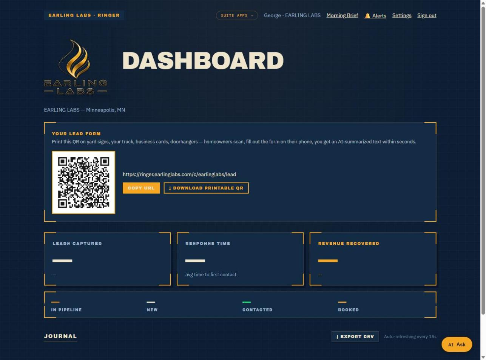
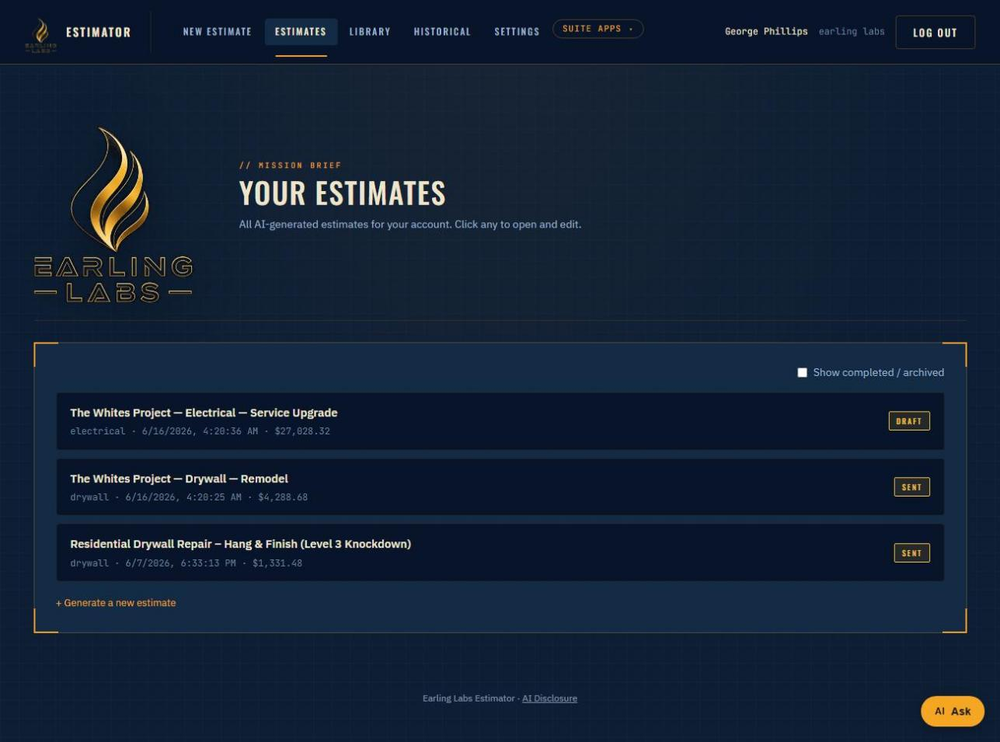
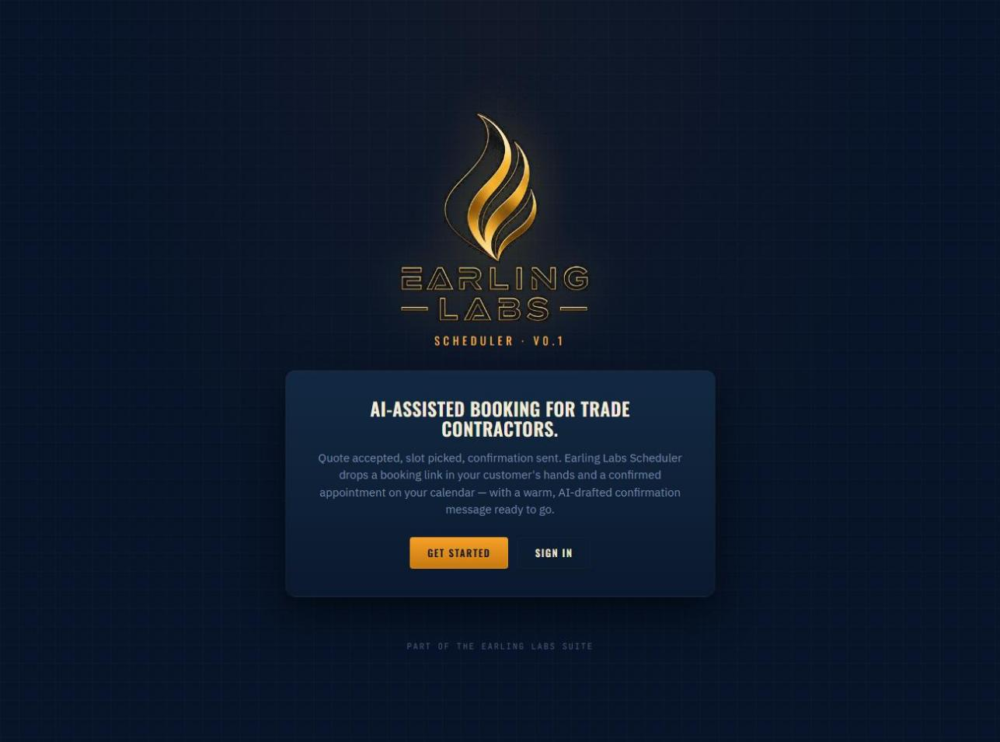
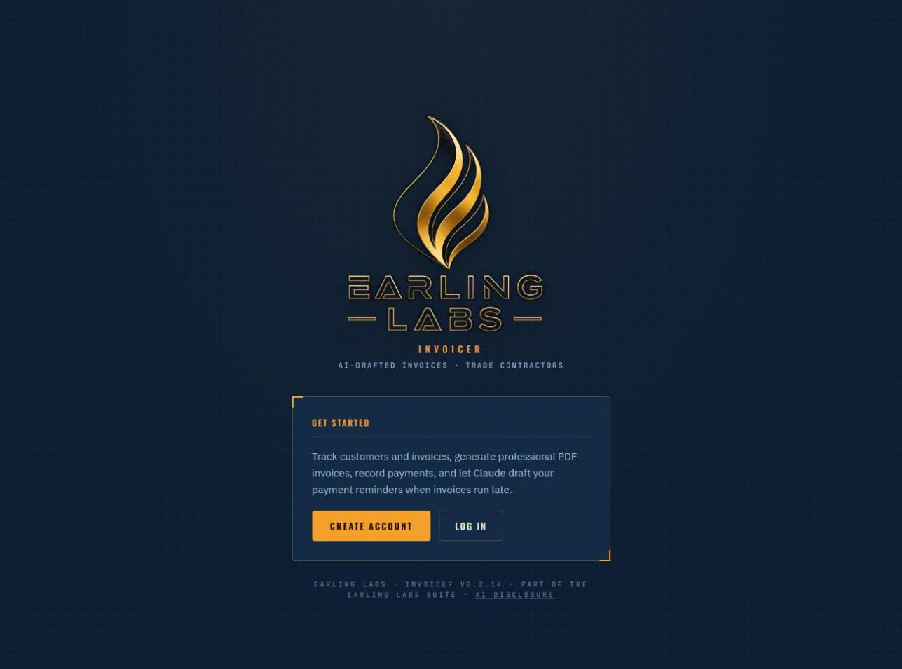
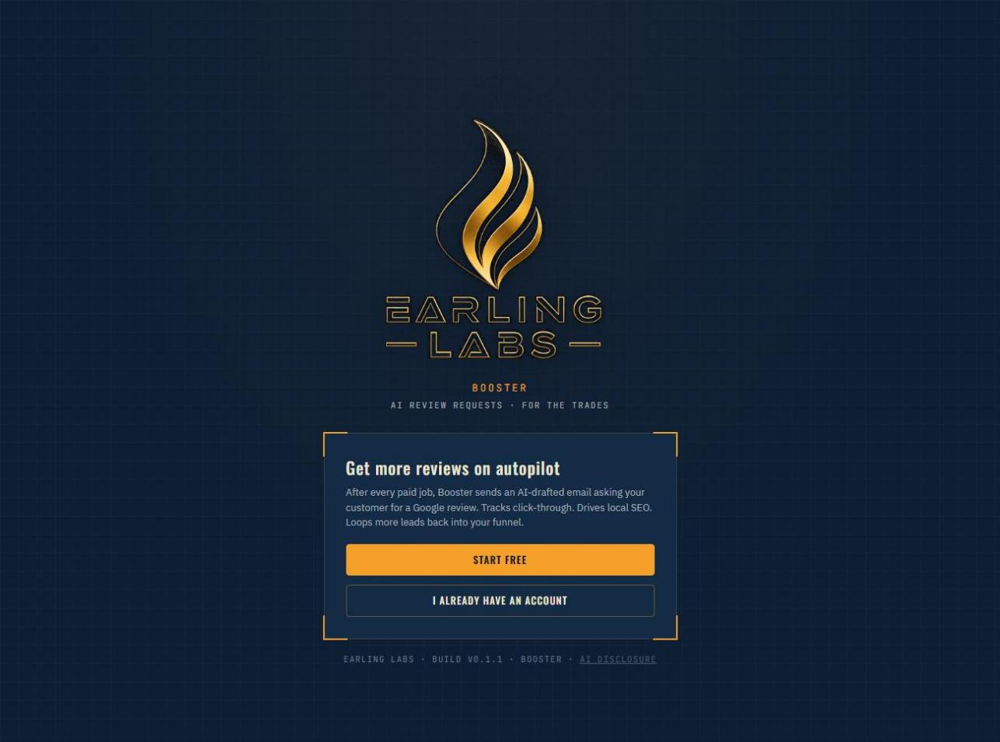
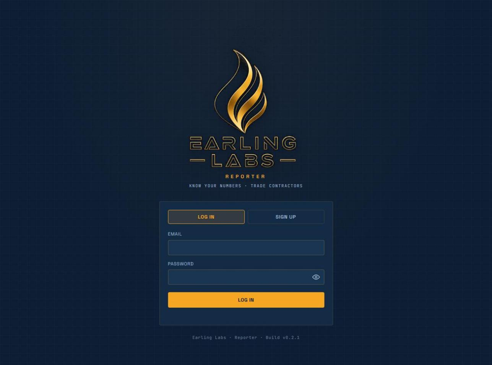
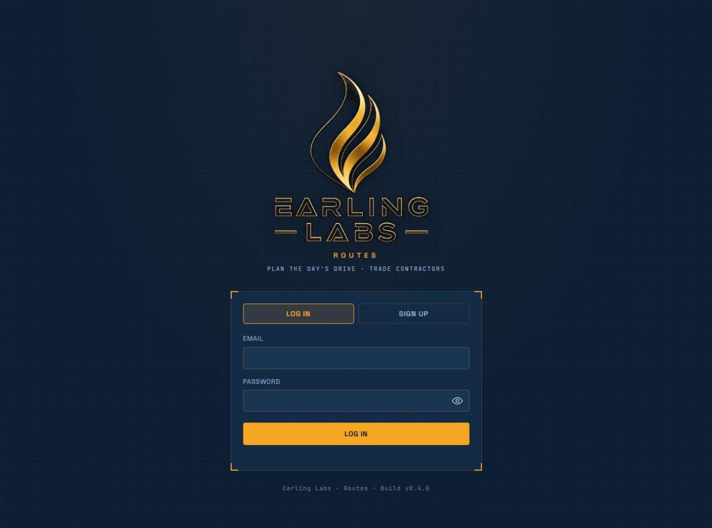
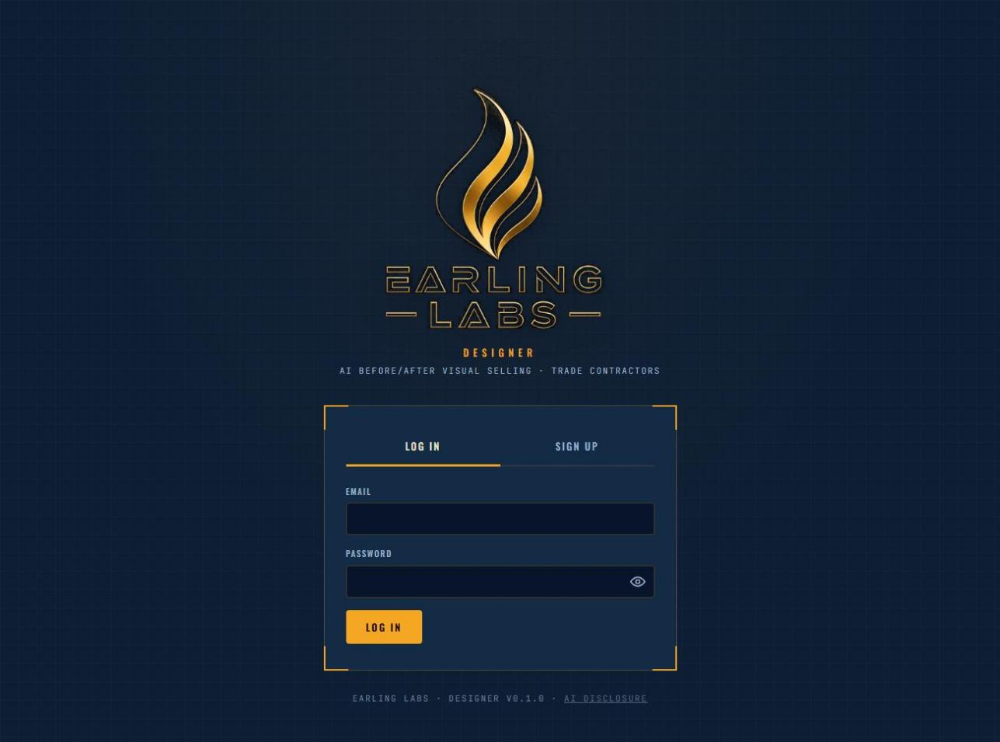
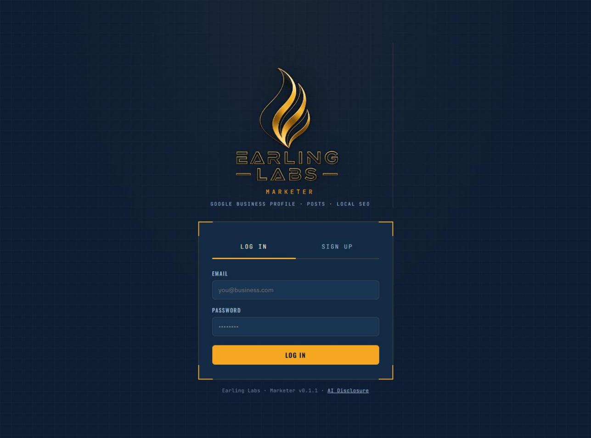

# Earling Labs

**Software for the people who build, sell, and trade.**

Earling Labs builds AI-powered software for working people — the contractor in the field, the small crew running jobs across town, the operator running their own shop, the trader watching the open. Practical tools that handle the unglamorous parts so you can focus on the work that pays.

---

## The Suite

Thirteen live products today — the trade-contractor suite is complete, with more on the bench. Each one solves a specific recurring frustration for a specific kind of operator. Names are intentional. Scope is small. Quality is the priority.

---

### Live Products

---

#### Ringer — Lead Capture · Text, Chat & Voice

AI answers texts, web chat, and phone calls 24/7, qualifies the job, and books the visit on your calendar. AI voice receptionist picks up calls you can't get to and texts you every detail.

---

#### Estimator — Job Pricing & Quotes

AI drafts branded estimates in minutes from your own historical rates. Upload site photos — Claude Vision measures the job. Customer portal for accept/decline.

---

#### Scheduler — Appointment Booking

AI-assisted appointment booking. Homeowner picks a slot after accepting their quote. Sends confirmations and reminders automatically. Pairs with Estimator to close the lead-to-job pipeline.

---

#### Invoicer — Billing & Payment Recovery

Sends the final bill with change orders, add-ons, and materials adjustments baked in. Tracks payment status. AI drafts payment reminders in friendly, firm, or final tone. Closes the lead-to-cash loop.

---

#### Receipts — Expense Capture

Snap a receipt — Claude Vision extracts vendor, amount, date, category, and payment method with confidence ratings per field. Export to CSV at tax time.

---

#### Booster — AI Review Requests

After the invoice is paid, AI drafts a personalized review-request email in your tone. Tracks click-through. More reviews drive local SEO, which drives more leads back into Ringer.

---

#### Jobs — Job Hub

Pro-tier container that ties the whole suite together — every job in one place with budget-vs-actual job costing, change orders, documents, and permits & inspections.

---

#### Reporter — Business Intelligence

Plain-language insight into how the business is doing — win rate, revenue, most profitable trade, money owed, and leaderboards. Reports on what the other products capture. No new data entry.

---

#### Crew — Roster & Crew Management

Everyone who works for you in one place — employees and subcontractors. Tracks compliance documents, warns before they expire, assigns workers to jobs, and logs hours.

---

#### Routes — Multi-Job Routing & Dispatch

Plan the day's drive. Import stops from Scheduler, set a depot, and Routes orders them to cut windshield time using real road distances, then dispatches the crew.

---

#### Designer — AI Before/After Visual Selling

Snap the before photo — Designer renders a before/after preview of the finished job while you're selling it. Customer swaps colors, fixtures, and finishes while the price updates in step, wired to your estimate.

---

#### Bookkeeper — AI Bookkeeping

Connect your business bank and AI sorts every transaction into the right tax category. Pulls receipts from Earling Labs Receipts or CSV import. Replaces QuickBooks for the solo contractor.

---

#### Marketer — Local SEO & Profile

Manage your Google Business Profile, draft and schedule Google posts with AI, and work a local-SEO checklist that scores your listing. Closes the loop back into lead generation.

---

### In Development

| Product | Category | What It Does |
|---|---|---|
| **Receptionist** | AI Voice Receptionist | Standalone AI that answers calls 24/7, qualifies the job, books it into your schedule, and texts you the details. Works alone or alongside Ringer. |
| **Closer** | AI Lead Reactivation | Puts your existing leads and past customers back to work. AI runs follow-up on cold quotes, old customers, and seasonal reminders, then books the ones who bite. |
| **Trading Platform** | AI Trading Research | An AI co-pilot for active traders. Real-time research, pre-trade gut-checks, multi-horizon quantile forecasts, personal pattern detection, and brokerage-aware risk discipline. Built by a trader, for traders. Not a signal service. |

---

## Pricing

One suite, three tiers. Flat pricing — everything in your tier included, no per-user fees. Founding members get a locked lifetime rate.

### Starter — The Solo Operator
- Full lead-to-cash pipeline: Ringer, Estimator, Scheduler, Invoicer, Receipts, Booster
- - Permits & inspections tracking
  - - Everything to run the business from a single place
   
    - ### Pro — Busy Shops, Real Volume
    - - Everything in Starter
      - - **Jobs** — job costing, change orders, documents, cross-job view
        - - **Designer** — AI before/after visual selling
          - - **Reporter** — plain-language business insights
            - - **Bookkeeper** — AI bank-feed categorization
             
              - ### Crew — When You Have People
              - - Everything in Pro
                - - Multiple users with roles and permissions
                  - - **Crew** — roster, compliance tracking, time logs
                    - - **Routes** — GPS routing for multi-job days
                      - - **Marketer** — local SEO and Google Business Profile
                        - - No per-user fees at any tier
                         
                          - > Pricing and sign-up open once Earling Labs is taking customers.
                            >
                            > ---
                            >
                            > ## About
                            >
                            > Earling Labs is an independent software company headquartered in Bloomington, Minnesota. Built by an operator, for operators. No VC pressure. No feature bloat. No quarterly roadmap theater. An AI-native suite that handles the back-office work the big platforms overcharge for — at a fraction of the cost.
                            >
                            > - **Founded:** 2026
                            > - - **Headquartered:** Bloomington, MN
                            >   - - **Entity:** Earling Labs LLC
                            >     - - **Products Live:** 13
                            >       - - **In Development:** 3
                            >         - - **Contact:** support@earlinglabs.com
                            >           - - **Site:** [earlinglabs.com](https://earlinglabs.com)
                            >            
                            >             - ---
                            >
                            > *© 2026 Earling Labs LLC. All rights reserved.*
